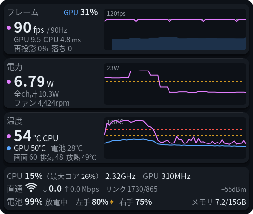
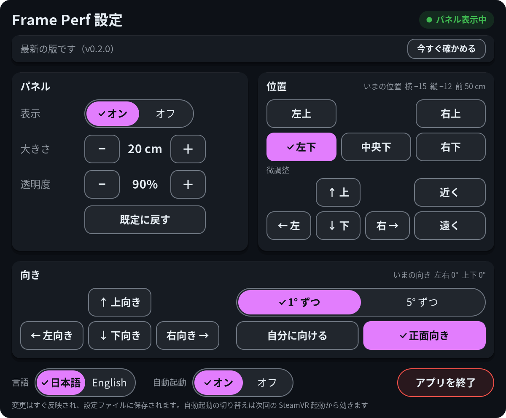
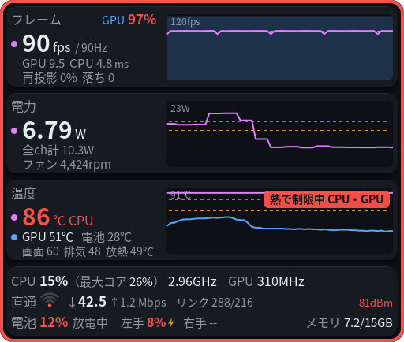

# frame-perf-overlay

Steam Frame 用の小さな性能パネルです。SteamVR の中に出しっぱなしにして、アプリの fps、GPU・CPU の負荷、温度、消費電力、電池の残量、Steam Link の無線の状態をひと目で見られるようにします。ゲームがカクつく理由や、本体が熱くなっている様子がその場で分かります。ヘッドセット本体（aarch64 の SteamOS）の上で、OpenVR のオーバーレイとして動きます。

[English](README.md)

https://github.com/user-attachments/assets/a749d90a-c6e8-4ea2-a881-61332d7e9ab4

Half-Life: Alyx を遊びながらヘッドセットの中で撮った動画です（音なし）。パネルは左下に出たままで、SteamVR ダッシュボードの **Perf** タブから位置・大きさ・言語を変えられます。



パネルは頭に追従し、既定では視界の左下に出ます。位置・大きさ・透明度・言語（日本語 / English）は SteamVR のダッシュボードから変えられます。言語の既定は Steam の言語設定に合わせます（日本語なら日本語、それ以外は英語）。



これらの画像はヘッドセットの中で撮ったものではなく、アプリ自身が書き出したもの（`--dump-png` / `--dump-settings-png`）です。パネルの画像のフレームの数値はダミーの値です。

## 表示する項目

| 段 | 大きい数字 | 補足 | グラフ（直近 30 秒） |
|---|---|---|---|
| フレーム | アプリの fps と表示のリフレッシュレート（例: `72 fps / 90Hz`） | 見出しの右に GPU 使用率（目安）。GPU・CPU の 1 フレームあたりの時間（ms）、再投影の割合、落ちたフレーム数 | fps の線、点線がリフレッシュレート、塗りが GPU 使用率。SteamVR がアプリをリフレッシュレートの半分（や 1/3）に抑えているときは黄色いバッジ |
| 電力 | 主電源レールの消費電力（W） | 全チャンネルの合計、ファン回転数 | 主電源レールの電力 |
| 温度 | CPU 温度（いちばん熱いコア） | GPU、電池、画面付近・排気・放熱（ヒートシンク付近）の温度 | CPU と GPU、しきい値の点線。熱で CPU か GPU のクロックが制限されている間は、赤いバッジとパネル全体の赤い枠 |
| 下の 1 行目 | CPU 使用率（全体・最も忙しいコア）、最速クラスタのクロック、GPU クロック | | |
| 下の 2 行目 | Steam Link の直通回線: 電波の強さ（Wi-Fi アイコンと dBm）、実際に流れている量（↓ PC→Frame、↑ Frame→PC、Mbps）、リンク速度。PC がつながっていないときはグレーのアイコンに斜線 | | |
| 下の 3 行目 | 本体の電池、左手・右手のコントローラーの電池（充電中は稲妻）、メモリ | | |

しきい値を超えた数字は黄色、さらに超えると赤になります。しきい値は設定ファイルで変えられます。



## 必要なもの

- 開発者モードを有効にして SSH で入れる Steam Frame（設定 → システム → 開発者モードを有効化、開発者の項目でパスワードを設定）。SSH を有効にすると、同じネットワークにいてパスワードを知っている人は誰でもヘッドセットに入れるので、推測されにくいパスワードにしてください
- ヘッドセットにファイルをコピーする手段（PC からの `scp` など）
- sudo は要りません。すべてホームフォルダに入ります

## インストール

[リリースページ](https://github.com/sasaken1102r/frame-perf-overlay/releases)から `frame-perf-overlay-<バージョン>.tar.gz` をダウンロードして、ヘッドセットにコピーします。PC からなら例えば:

```sh
scp frame-perf-overlay-*.tar.gz steamos@<ヘッドセットのIP>:
```

そのあとヘッドセット上で（`ssh steamos@<ヘッドセットのIP>`）:

```sh
tar xzf frame-perf-overlay-*.tar.gz
cd frame-perf-overlay
./install.sh
```

入るもの:

- 実行ファイル: `~/.local/bin/frame-perf-overlay`
- ＋の一覧に出すための `.desktop` とアイコン: `~/.local/share/applications/frame-perf-overlay.desktop`、`~/.local/share/icons/hicolor/{48x48,128x128,256x256}/apps/frame-perf-overlay.png`
- SteamVR と一緒に起動する systemd のユーザーサービス: `~/.config/systemd/user/frame-perf-overlay.service`

SteamVR が動いていれば、その場でパネルが出ます。SteamOS を更新しても消えません。更新するときは、新しいバージョンのフォルダで `./install.sh` を実行します。

オプション:

- `./install.sh --no-autostart`: サービスを有効にせずに入れます。ダッシュボードの＋から自分で起動して使います（下の「使い方」）
- `./install.sh --uninstall`: 止めて、上のファイルをすべて消します。設定（`~/.config/frame-perf-overlay/`）は残すので、要らなければそのフォルダも消してください

## 使い方

- **パネル**: 自動起動がオンなら、SteamVR が動いている間はずっと出ています。操作は要りません
- **設定**: SteamVR のダッシュボードを開き、下の並びの **Perf** のタブを選びます。レーザーポインターで押して操作します

  | ボタン | 動き |
  |---|---|
  | 表示: オン / オフ | パネルを出す・隠す。隠している間は値の読み取りと描画も止まります |
  | 大きさ − / ＋ | 幅を 2cm ずつ（6cm〜1m） |
  | 透明度 − / ＋ | 10% ずつ（20%〜100%） |
  | 既定に戻す | 表示・位置・大きさ・透明度を既定に戻します |
  | 左上 / 右上 / 左下 / 中央下 / 右下 | 視界のその位置へ動かします |
  | ← 左 / 右 → / ↑ 上 / ↓ 下 | 2cm ずつ動かします |
  | 近く / 遠く | 見える方向はそのままで 5cm ずつ近づけ・遠ざけます（20cm〜3m） |
  | 言語 | 日本語 / English。すぐ切り替わります |
  | 自動起動: オン / オフ | systemd のサービスを有効・無効にします。効くのは次の SteamVR 起動から |
  | アプリを終了 | 3 秒以内にもう一度押すと終了します |

  変更はすぐ反映され、設定ファイルに保存されます。
- **＋（プログラムを起動）**: ダッシュボードの＋の一覧に **Frame Perf Overlay** が出ます。動いていなければ起動し、すでに動いていれば、もう一度起動するたびにパネルの表示と非表示を切り替えます
- **終わらせる**: ダッシュボードの下の **Perf** のアイコンにレーザーを合わせて「閉じる」を押すか、設定の「アプリを終了」を使います。安全な終了処理を通って終わり、次に SteamVR が起動するまで（または＋や `systemctl --user start frame-perf-overlay` で起動するまで）は止まったままです

## 設定ファイル

`~/.config/frame-perf-overlay/config.json`（`$XDG_CONFIG_HOME` があればその下）。無ければ既定値で動きます。ダッシュボードで変えた内容はここに保存されるので、手で書くのはしきい値やフォントを変えたいときだけです。書かなかった項目は既定値のままです。動いている間に保存すると、次の更新で読み直します。JSON が壊れているときは前の設定のまま動き、理由をログに出します。範囲外の値は丸め、知らないキーはログで知らせます。

全項目を既定値で書いた例: [`contrib/config.example.json`](contrib/config.example.json)

| キー | 既定値 | 説明 |
|---|---|---|
| `visible` | `true` | `false` でパネルを隠す（値の読み取りと描画も止める） |
| `language` | Steam の言語 | `"ja"`（日本語）か `"en"`（English） |
| `position.x` / `.y` / `.z` | `-0.15` / `-0.12` / `-0.5` | 頭から見たパネル中心の位置（m）。右が +x、上が +y、前が −z |
| `width_m` | `0.2` | パネルの幅（m）。高さは縦横比（512×434）で決まる |
| `alpha` | `0.9` | パネル全体の不透明度（0〜1） |
| `update_interval_ms` | `500` | 更新間隔（100〜5000 ms） |
| `graph_seconds` | `30` | グラフに出す秒数（5〜300） |
| `font` / `font_bold` | Noto Sans CJK の Regular / Bold | フォントファイル。読めなければ fontconfig で「Noto Sans CJK JP」を探す |
| `thresholds.fps_warn_ratio` / `fps_crit_ratio` | `0.95` / `0.75` | アプリの fps が「リフレッシュレート × この割合」**未満**で黄 / 赤 |
| `thresholds.frame_warn_ratio` / `frame_crit_ratio` | `0.9` / `1.0` | GPU・CPU 時間が「1 フレームの目標時間 × この倍率」以上で黄 / 赤 |
| `thresholds.reproj_warn_pct` / `reproj_crit_pct` | `5` / `20` | 再投影の割合（%）。落ちたフレームがあっても黄 |
| `thresholds.temp_warn_c` / `temp_crit_c` | `70` / `80` | CPU・GPU 温度（℃） |
| `thresholds.battery_warn_pct` / `battery_crit_pct` | `30` / `15` | 本体の電池（%）。**これ以下**で黄 / 赤 |
| `thresholds.power_warn_w` / `power_crit_w` | `13` / `16` | 主電源レールの電力（W） |
| `thresholds.cpu_warn_pct` / `cpu_crit_pct` | `85` / `97` | 最も忙しいコアの使用率（%） |
| `thresholds.gpu_warn_pct` / `gpu_crit_pct` | `85` / `95` | GPU 使用率の目安（%） |
| `thresholds.wifi_warn_dbm` / `wifi_crit_dbm` | `-70` / `-78` | 直通回線の電波（dBm）。**これ以下**で黄 / 赤。Wi-Fi アイコンが 3 本→2 本、2 本→1 本になる境目も兼ねる |
| `thresholds.controller_warn_pct` / `controller_crit_pct` | `20` / `10` | コントローラーの電池（%）。**これ以下**で黄 / 赤 |

別の設定ファイルを使うときは、`--config パス` を付けて起動します。

## 自動起動

`./install.sh` は systemd のユーザーサービスを入れて有効にします。サービスは SteamVR（`steamvr.service`）が起動すると一緒に起動し、止まると一緒に止まります。それ以外の理由で終わったときは 5 秒後に起動し直します。「アプリを終了」やダッシュボードの「閉じる」で終わったときは、次の SteamVR 起動まで起動し直しません。

```sh
systemctl --user status frame-perf-overlay         # 動いているか
systemctl --user restart frame-perf-overlay        # 起動し直す
systemctl --user disable --now frame-perf-overlay  # 自動起動をやめて、今すぐ止める
systemctl --user enable frame-perf-overlay         # 自動起動を戻す
```

ダッシュボードの「自動起動」のボタンは、同じ `enable` / `disable` を実行します（`--now` は付けないので、動いているパネルは止まりません）。サービスのファイルが入っていないとき（自分でビルドして `install.sh` を使っていないときなど）は、ボタンがグレーになってその旨が出ます。

## うまく動かないとき

- **ログ**: `journalctl --user -u frame-perf-overlay -f`。`[VR] SteamVR につながりました` と出ていれば SteamVR につながっています
- **パネルが出ない**: SteamVR が動いているか（アプリは SteamVR を待つだけで、自分では起動しません）、Perf のタブで「表示」がオンか、サービスが動いているか（`systemctl --user status frame-perf-overlay`）を確かめてください。動いているときに＋から起動するとパネルが隠れるので、もう一度起動すると出ます
- **＋の一覧に出ない**: `./install.sh` をもう一度実行して、`~/.local/share/applications/frame-perf-overlay.desktop` があるか確かめてください
- **値が `--` になる**: そのセンサーが見つからないか、読めていません。センサーは起動時に名前で探すので、SteamOS の更新で名前が変わるとこうなります。`frame-perf-overlay --print` で見つかったものを一覧できます
- **フレームの段が「SteamVR 未接続」**: まだ SteamVR につながっていません。3 秒おきに再試行します
- **文字化けする・字が出ない**: 設定ファイルの `font` / `font_bold` を確かめてください

## 値の正確さ

実機で別の方法と照らし合わせて確かめた値と、目安にとどまる値があります。後者はおおよその目安として見てください。

**別の方法と照らし合わせて確かめた値**

- **fps・再投影**: SteamVR 自身のフレームの記録と一致
- **CPU 使用率・クロック、GPU クロック、メモリ、本体の電池**: `top` や `/proc`・`/sys` の生の値と一致
- **CPU・GPU・電池の温度**: センサーの生の値と 1〜2℃ 以内で一致
- **ファンの回転数**: 生の値を 2 で割った値。SteamOS 自身のファン制御と同じ換算です

**目安の値**

- **消費電力**: 各チャンネルが何の回路かは公開されていません。主電源レールが全体の供給にあたるというのは推測で、「全ch計」は重複して数えている可能性があります
- **GPU 使用率**: カーネルが自分のユーザーのプロセスごとに出している GPU の稼働時間の合計です。root のプロセスの分は数えず、重なった分は 100% で止め、新しく GPU を使い始めたプロセスは数え始めるまで最大 30 秒かかります
- **Steam Link で遊んでいるときの fps**: PC 側や回線で落ちたコマがいつも fps の低下として出るかは、まだ確かめていません
- **直通回線の流量**: ストリーミング以外も含めた、直通回線を流れる量すべてです
- **画面・排気・放熱の温度**: 呼び名はセンサーの名前から付けたもので、正確な位置は公開されていません
- **コントローラーの電池**: SteamVR が返す値をそのまま出しています

## 既知の問題

- 一部の値は目安です。[値の正確さ](#値の正確さ)を見てください
- CPU 温度はいちばん熱いコアの値なので、短い負荷で 1〜2℃ 跳ねます
- 電力のセンサー自体の更新が 1.5〜2 秒おきなので、電力は 2 秒おき、電池は 5 秒おきに読んでいます
- ダッシュボードのアイコンのボタンは「アプリを終了」ではなく「閉じる」と出ます（Steam のアプリではないため）
- コマンドラインの出力（`--print`、`--help`）とログは日本語だけです
- コントローラーのボタンの割り当てはありません。ダッシュボードか設定ファイルで変えてください

## プライバシー

- テレメトリはなく、ヘッドセットの外とは一切通信しません（Wi-Fi の状態は、ヘッドセット自身のカーネルに問い合わせるだけです）
- Steam Link の直通回線については、ヘッドセット自身の Wi-Fi ドライバから、電波の強さ・リンク速度・送受信したバイト数だけを本体の中で読んで表示しています。PC やヘッドセットの MAC アドレスやネットワーク名（SSID）は、取り出さず、画面にもログにも出しません
- 書き込むファイルは設定ファイルだけです（保存するときは、隣に一時ファイル `config.json.tmp` を書いてから置き換えます）。ほかに、アプリのプロセス ID を入れた小さなロックファイルを `/run/user/<uid>` に置きます（メモリ上だけのフォルダ。無い環境では `/tmp`）
- ログはヘッドセットの中の systemd のジャーナルに残るだけです

## 免責事項

- 非公式のプロジェクトで、Valve Corporation と提携・承認・後援関係にはありません。Steam、Steam Frame、SteamVR、Steam Link は、米国および／またはその他の国における Valve Corporation の商標および／または登録商標です。対応製品を示す目的でのみ名前を使っています
- 自己責任でお使いください。本ソフトウェアは無保証です（[LICENSE](LICENSE) を参照）。**このソフトウェアの使用によって生じたいかなる損害（本体やアカウントに関するものを含む）についても、作者は一切の責任を負いません**
- AI（Claude）を使って作りました。作者はコードのレビューはしておらず、自分の Steam Frame で動作を確かめただけです。あなたの環境で同じように動くとは限らないので、使う前にコードを自分の目で確認してください
- このアプリがヘッドセットの上ですること:
  - sysfs と `/proc` は**読むだけ**です（センサー、CPU、メモリ、自分のユーザーのプロセスについてカーネルが出している GPU の稼働時間）。そこへは書き込まず、ファン・クロック・電源の設定やカメラにも触りません。既定の言語を決めるために、起動時に 1 回だけ Steam の `~/.steam/registry.vdf` の `language` の行も読みます（読むだけ）
  - 書き込むのは次のものだけです: 自分の設定ファイル、`install.sh` が入れる `~/.local` 以下のファイルと `~/.config/systemd/user` のサービスのファイル、「自動起動」のボタンを押したときの自分のサービスの `systemctl --user enable` / `disable`
  - Steam や SteamVR のファイル・設定は変えません。ふつうの OpenVR のオーバーレイで、公開されている OpenVR の API だけを使います
- このアプリは Steam や SteamVR のプロセスに手を入れず、改変や差し込みもしません。ほかの SteamVR のオーバーレイと同じように動き、Linux がふつうのユーザーに見せている情報を読むだけです。それでも Steam の使い方には [Steam 利用規約](https://store.steampowered.com/subscriber_agreement/?l=japanese)が適用されるので、気になる場合は読んだうえでご自身で判断してください

## 開発

ビルドはヘッドセット上で行います（SteamOS の cairo・FreeType・libnl・Vulkan ローダーと、SteamVR の `libopenvr_api.so` にリンクするため）。必要な道具とライブラリは SteamOS に入っています: cmake、ninja、g++、pkg-config、cairo・freetype2・vulkan・libnl-genl-3.0 の開発用ファイル。`openvr.h`（OpenVR SDK 2.15.6）は `third_party/openvr/` に同梱しています。

```sh
cmake -G Ninja -S . -B build
cmake --build build
./install.sh               # build/frame-perf-overlay を入れる
scripts/package.sh         # リリース用にビルドして dist/frame-perf-overlay-<バージョン>.tar.gz を作る
```

確認に便利なオプション（最後のもの以外は SteamVR なしで動きます）:

```sh
./build/frame-perf-overlay --print --count 5        # 読み取った値を 1 秒おきに 5 回表示
./build/frame-perf-overlay --dump-png panel.png --seconds 30 --fake-frames --language ja
./build/frame-perf-overlay --dump-settings-png settings.png --language ja
./build/frame-perf-overlay --contrast-report        # 使っている色の組み合わせごとの WCAG のコントラスト比
./build/frame-perf-overlay --verbose                # オーバーレイとして動かし、数秒ごとに値をログに出す
```

すべてのオプションは `--help` で見られます。バージョンは `CMakeLists.txt` の `project(... VERSION ...)` で決まり、`--version` で表示されます。

## ライセンス

MIT。[LICENSE](LICENSE) を参照してください。同梱している `openvr.h` は BSD-3-Clause です。実行時に使うシステムのライブラリとフォントは [THIRD_PARTY_LICENSES.md](THIRD_PARTY_LICENSES.md) に、変更履歴は [CHANGELOG.md](CHANGELOG.md) にあります。
