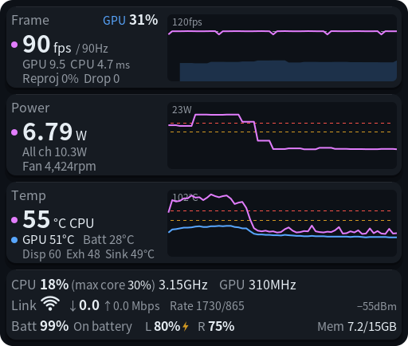
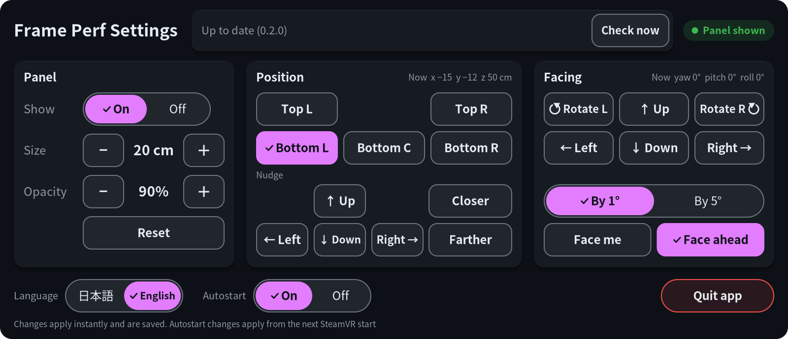
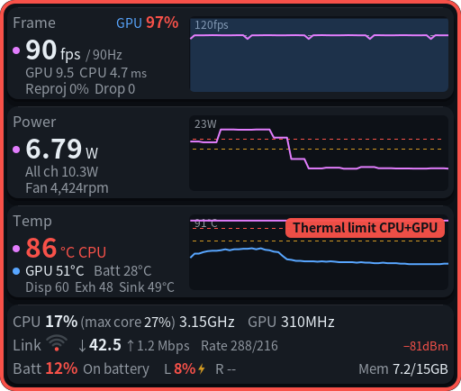

# frame-perf-overlay

This local branch adds a clock and controller-attached wrist placement. See [Wrist & clock](#wrist--clock-local-build) below.

A small performance panel for the Steam Frame. It stays in view inside SteamVR and shows the app's frame rate, GPU and CPU load, temperatures, power draw, battery levels and the Steam Link wireless link, so you can see at a glance why a game stutters or the headset gets hot. It runs on the headset itself (aarch64 SteamOS) as an OpenVR overlay.

[日本語版はこちら](README.ja.md)

https://github.com/user-attachments/assets/a749d90a-c6e8-4ea2-a881-61332d7e9ab4

Recorded inside the headset while playing Half-Life: Alyx (no sound). The panel stays in the lower left, and the **Perf** tab of the SteamVR dashboard changes its position, size and language.



The panel follows your head and sits in the lower left of your view by default. Position, facing, size, opacity and language (English / Japanese) can be changed from the SteamVR dashboard.



These images were written out by the app itself (`--dump-png` / `--dump-settings-png`), not captured inside the headset. The frame numbers in the panel image are sample values.

## What it shows

| Row | Main number | Details | Graph (last 30 s) |
|---|---|---|---|
| Frame | The app's frame rate and the display refresh rate (e.g. `72 fps / 90Hz`) | GPU usage (estimate) next to the title; GPU and CPU time per frame (ms), reprojection ratio, dropped frames | Frame rate, with the refresh rate as a dotted line and GPU usage as a shaded area. A yellow badge shows when SteamVR is holding the app at half (or a third) of the refresh rate |
| Power | Power draw of the main supply rail (W) | Sum of all measured channels, fan speed | Main rail power |
| Temp | CPU temperature (hottest core) | GPU, battery, and near the display / exhaust / heat sink | CPU and GPU, with the warning thresholds. A red badge and a red frame around the panel appear while heat is throttling the CPU or GPU |
| Bottom line 1 | CPU usage (overall and busiest core), fastest cluster clock, GPU clock | | |
| Bottom line 2 | Wireless. **Link** when a PC is on the Steam Link direct wireless link; otherwise **Wi-Fi** for the access point the headset is joined to (e.g. your home Wi-Fi). Signal strength (Wi-Fi icon and dBm), data actually flowing (↓ into the headset, ↑ out of it, Mbps) and link rates. A grey crossed-out icon means neither is connected | | |
| Bottom line 3 | Headset battery, left and right controller batteries (a bolt while charging), memory | | |

Numbers over a threshold turn yellow, and red past a second threshold. The thresholds can be changed in the settings file.



## Requirements

- A Steam Frame with Developer Mode on and SSH access (Settings > System > Developer Mode, then set a password under Developer). Choose a strong password: with SSH on, anyone on your network who knows it can log in to the headset.
- A way to copy a file to the headset (for example `scp` from your PC).
- No sudo. Everything is installed into your home directory.

## Install

Download `frame-perf-overlay-<version>.tar.gz` from the [releases page](https://github.com/sasaken1102r/frame-perf-overlay/releases) and copy it to the headset, for example from your PC:

```sh
scp frame-perf-overlay-*.tar.gz steamos@<headset-ip>:
```

Then on the headset (`ssh steamos@<headset-ip>`):

```sh
tar xzf frame-perf-overlay-*.tar.gz
cd frame-perf-overlay
./install.sh
```

This installs:

- the program: `~/.local/bin/frame-perf-overlay`
- the launcher entry and icons: `~/.local/share/applications/frame-perf-overlay.desktop`, `~/.local/share/icons/hicolor/{48x48,128x128,256x256}/apps/frame-perf-overlay.png`
- a systemd user service that starts together with SteamVR: `~/.config/systemd/user/frame-perf-overlay.service`
- the updater script used by the **Update** button: `~/.local/share/frame-perf-overlay/frame-update.sh`, and the options you installed with, for the next update: `~/.config/frame-perf-overlay/install-args` (see [Updates](#updates))

If SteamVR is running, the panel appears right away. SteamOS updates don't remove these files. New versions can be installed from the bar in the Perf tab (see [Updates](#updates)); to update by hand, run `./install.sh` from the new version's folder.

Options:

- `./install.sh --no-autostart` installs without the service being enabled. Start it yourself from the dashboard's **+** button (see below).
- `./install.sh --uninstall` stops it and removes everything above except the folder `~/.config/frame-perf-overlay/` (your settings and `install-args`). Delete that folder too if you want them gone, and `~/.cache/frame-perf-overlay/` (the updater's cache and log) if it exists.

## Usage

- **The panel** shows up whenever SteamVR runs (with autostart on). It needs no input.
- **The language follows your Steam Frame's language** (Japanese if Steam is set to Japanese, English otherwise). To change it, open the **Perf** tab (below) and use **Language** at the bottom left.
- **Settings**: open the SteamVR dashboard and pick the **Perf** tab at the bottom. Point with the laser and click.

  | Control | What it does |
  |---|---|
  | Show: On / Off | Show or hide the panel. While hidden, nothing is read or drawn |
  | Size − / + | Panel width in 2 cm steps (6 cm to 1 m) |
  | Opacity − / + | In 10 % steps (20 % to 100 %) |
  | Reset | Put show, position, facing, size and opacity back to the defaults |
  | Top L / Top R / Bottom L / Bottom C / Bottom R | Move the panel to that corner of your view and turn it to face you |
  | ← Left / Right → / ↑ Up / ↓ Down | Nudge the panel by 2 cm. The facing stays as it is |
  | Closer / Farther | Move it 5 cm nearer or further (20 cm to 3 m), keeping the direction |
  | Facing: ← Left / Right → / ↑ Up / ↓ Down | Turn the panel's face by the chosen step (left/right up to ±180°, up/down up to ±90°). It snaps to the step: at 16.7°, By 5° goes to 20° or 15° |
  | ⟲ Rotate L / Rotate R ⟳ | Spin the panel in its own plane (roll) by the chosen step, counterclockwise / clockwise as you look at it (up to ±180°). Use it if the panel doesn't look level to you |
  | By 1° / By 5° | How far one press of the facing arrows and the rotate buttons turns the panel. Starts at 1° each time the app starts (not saved) |
  | Face me | Keep the position and turn the panel so it faces your head. The rotation from Rotate L / R (roll) is kept |
  | Face ahead | Remove the rotation, so the panel is parallel to your face again (the look before this feature) |
  | Language | English or Japanese, applied immediately |
  | Autostart: On / Off | Turn the systemd service on or off. Takes effect from the next SteamVR start |
  | Quit app | Click twice within 3 seconds to quit |

  Changes apply immediately and are saved to the settings file.
- **Updates**: a bar in the title row, right of the title, always shows the running version, e.g. `Up to date (0.2.0)` (with the automatic check turned off, just the version until you check), with a **Check now** button that asks GitHub right away (it works even with the automatic check turned off). What the bar shows:
  - **New version**: a pink border, `Version 0.2.1 is available`, **Check now** and **Update**. **Update** asks `Update to 0.2.1?` with **Cancel** / **Update**; the second **Update** starts the install.
  - **Updating**: the step (`Updating: Downloading`, …) and, on the right, a small grey note that the panel may close and reopen meanwhile. It does, once, when the new version starts.
  - **Update failed**: a red border, the reason, **Try again** and **Close**. The version you had keeps running.
  - **Couldn't check** (no network, GitHub unreachable, …): the border stays normal and only the text turns red, with **Check now**.
  - **Can't install from here** (the release has no `SHA256SUMS` or no tar.gz for this app): a pink border and a note to update by hand from GitHub (see [Install](#install)).
- **The + button** ("launch a program") in the dashboard lists **Frame Perf Overlay**. If it isn't running, this starts it. If it is already running, launching it again toggles the panel between shown and hidden.
- **Quitting**: hover over the **Perf** icon at the bottom of the dashboard and press its close button, or use **Quit app** in the settings. It shuts down cleanly and stays off until the next SteamVR start (or until you start it from **+** or with `systemctl --user start frame-perf-overlay`).

## Wrist & clock (local build)

Open **Perf → Wrist & clock**. The **Panel & position** button in the bottom row switches back to the main controls.

- **Clock:** Off, 12h (AM/PM), or 24h. Uses the headset's local time zone; 24h is enabled by default. Updates with the performance panel (normally every 500 ms).
- **Attachment:** Head, Left wrist, or Right wrist. Wrist modes follow the respective **controller**, not bare-hand tracking. Head remains the default and keeps your existing head position.
- **Offsets:** X/Y/Z buttons move the selected wrist panel in 1 cm steps, limited to ±50 cm. These are controller-local axes: X right, Y up, Z back. Each wrist remembers its own settings.
- **Rotation:** Pitch X, Yaw Y, and Roll Z change in 5° steps, wrapping at ±180°. Rotations are applied X, then Y, then Z. Initial wrist pose is (0, 5, 8) cm, with pitch −90°; tune it while holding the controller as you normally would.
- **Angle fade:** On by default for wrists only. The panel is fully visible when its front faces your eyes, fades smoothly as you turn it away, and becomes invisible when facing away. The default fade range is 45–75° between the panel's front normal and the line from the panel to your headset. Use −/+ to move the 30° fade band (ending at 35–90°). Off keeps the wrist panel visible at the selected opacity regardless of angle.
- Fading is smoothed over time and checked at up to 60 Hz without redrawing sensors at that rate. Controller attachment itself follows SteamVR tracking. Loss of controller or headset tracking hides the wrist panel immediately; valid tracking restores it automatically. **Perf** settings stay accessible even while the wrist panel is hidden.
- Size and opacity remain on **Panel & position**. Its position controls adjust the saved **head** placement. **Reset** also resets both wrists, attachment, fade, and clock format; language and thresholds are preserved.

Config additions (old config files continue to work):

```json
{
  "attachment": "head",
  "left_wrist": { "x": 0, "y": 0.05, "z": 0.08, "pitch": -90, "yaw": 0, "roll": 0 },
  "right_wrist": { "x": 0, "y": 0.05, "z": 0.08, "pitch": -90, "yaw": 0, "roll": 0 },
  "wrist_fade": true,
  "wrist_fade_end_deg": 75,
  "clock_format": 24
}
```

Build and test on the headset:

```sh
cmake -G Ninja -S . -B build
cmake --build build -j2
ctest --test-dir build --output-on-failure
```

The custom binary reports `0.2.0-tai.2`. Automated checks cover transforms, facing/back-facing angles, fade smoothing, invalid/lost tracking, recovery from failed opacity/show/hide calls, attachment/reappearance fade timing, clock boundaries, saved settings, and settings button hit tests. Wrist comfort and controller orientation still need in-headset calibration. To render the wrist settings page without SteamVR, use `--dump-settings-png` with a config whose attachment is `left_wrist` or `right_wrist`.

## Settings file

`~/.config/frame-perf-overlay/config.json` (under `$XDG_CONFIG_HOME` if that is set). If it doesn't exist, the defaults are used. The dashboard writes it for you; you only need to edit it by hand for the thresholds or the fonts. Keys you leave out keep their defaults. Changes are picked up while the app runs (within one update). If the JSON is broken, the app keeps its previous settings and writes the reason to the log. Out-of-range values are clamped and unknown keys are reported in the log.

A file with every key at its default value is in [`contrib/config.example.json`](contrib/config.example.json).

| Key | Default | Meaning |
|---|---|---|
| `visible` | `true` | `false` hides the panel (and stops reading and drawing) |
| `update_check` | `true` | `false` turns off the automatic checks for a new release (at start and daily). The **Check now** button in the Perf tab still works either way |
| `language` | your Steam language | `"en"` (English) or `"ja"` (Japanese) |
| `position.x` / `.y` / `.z` | `-0.15` / `-0.12` / `-0.5` | Panel center relative to your head, in meters. +x is right, +y is up, −z is forward |
| `rotation.yaw` / `.pitch` / `.roll` | `0` / `0` / `0` | Panel rotation in degrees. `yaw` turns the face left/right (positive = toward +x, −180 to 180), `pitch` tilts it up/down (positive = up, −90 to 90), `roll` spins it in its own plane (positive = counterclockwise as you look at it, −180 to 180). Applied in the order yaw → pitch → roll. All 0 keeps the panel parallel to your face. "Face me" and the corner buttons set yaw and pitch and keep roll as it is |
| `width_m` | `0.2` | Panel width in meters. The height follows from the aspect ratio (512 × 460) |
| `alpha` | `0.9` | Opacity of the whole panel (0 to 1) |
| `update_interval_ms` | `500` | Update interval (100 to 5000 ms) |
| `graph_seconds` | `30` | Seconds shown in the graphs (5 to 300) |
| `font` / `font_bold` | Noto Sans CJK Regular / Bold | Font files. If they can't be read, "Noto Sans CJK JP" is looked up with fontconfig |
| `thresholds.fps_warn_ratio` / `fps_crit_ratio` | `0.95` / `0.75` | Yellow / red when the app's frame rate is **below** refresh rate × this ratio |
| `thresholds.frame_warn_ratio` / `frame_crit_ratio` | `0.9` / `1.0` | Yellow / red when GPU or CPU time is at least the frame budget × this factor |
| `thresholds.reproj_warn_pct` / `reproj_crit_pct` | `5` / `20` | Reprojection ratio (%). Any dropped frame also turns it yellow |
| `thresholds.temp_warn_c` / `temp_crit_c` | `70` / `80` | CPU and GPU temperature (°C) |
| `thresholds.battery_warn_pct` / `battery_crit_pct` | `30` / `15` | Headset battery (%), yellow / red at or **below** |
| `thresholds.power_warn_w` / `power_crit_w` | `13` / `16` | Main rail power (W) |
| `thresholds.cpu_warn_pct` / `cpu_crit_pct` | `85` / `97` | Busiest CPU core (%) |
| `thresholds.gpu_warn_pct` / `gpu_crit_pct` | `85` / `95` | Estimated GPU usage (%) |
| `thresholds.wifi_warn_dbm` / `wifi_crit_dbm` | `-70` / `-78` | Wireless signal (dBm, direct link or Wi-Fi), yellow / red at or **below**. Also where the Wi-Fi icon drops from 3 to 2 and from 2 to 1 bars |
| `thresholds.controller_warn_pct` / `controller_crit_pct` | `20` / `10` | Controller battery (%), yellow / red at or **below** |

To use a different file, start the program with `--config PATH`.

## Autostart

`./install.sh` installs a systemd user service and enables it. The service starts when SteamVR (`steamvr.service`) starts and stops with it. If the app exits for another reason it is started again after 5 seconds; after **Quit app** or the dashboard's close button it stays off until the next SteamVR start.

```sh
systemctl --user status frame-perf-overlay      # is it running?
systemctl --user restart frame-perf-overlay     # restart it
systemctl --user disable --now frame-perf-overlay  # turn autostart off and stop it now
systemctl --user enable frame-perf-overlay      # turn autostart back on
```

The **Autostart** switch in the dashboard runs the same `enable` / `disable` (without `--now`, so the running panel stays up). If the service file isn't installed (for example when you built the program yourself and never ran `install.sh`), the switch is greyed out and says so.

## Updates

`install.sh` puts a small updater script at `~/.local/share/frame-perf-overlay/frame-update.sh`. The panel runs it in the background.

- **When it checks**: at start and then every hour it asks the script, but the script asks GitHub at most once every 24 hours and reuses the last answer in between (after a failed check it tries again after an hour). **Check now** skips that cache. Setting `update_check` to `false` in the [settings file](#settings-file) stops the automatic checks (including the one at start); **Check now** and **Update** keep working.
- **What it installs**: only after you confirm, it downloads the release's tar.gz and `SHA256SUMS` (from github.com / api.github.com / \*.githubusercontent.com over HTTPS), checks the tar.gz's SHA-256 against `SHA256SUMS` before extracting it, and refuses a release whose `SHA256SUMS` is missing or doesn't match. Then it runs that release's own `install.sh` with the options you used last time (kept in `~/.config/frame-perf-overlay/install-args`), so it installs exactly what running `./install.sh` by hand would.
- **Where it runs**: the install runs as a separate, temporary systemd user unit, `frame-perf-overlay-update`, so it keeps going while `install.sh` restarts the panel. Its log is `~/.cache/frame-perf-overlay/update.log` (and `journalctl --user -u frame-perf-overlay-update`).
- **If it fails**: the version you had stays installed and keeps running; the bar shows the reason.
- **What the check protects against**: `SHA256SUMS` sits in the same GitHub release, so it catches a broken or truncated download, but not a release that was itself replaced — it is a checksum, not a signature.
- **From v0.1.0**: v0.1.0 has no updater, so update to 0.2.0 by hand once (download it and run `./install.sh` from its folder, as in [Install](#install)). After that the panel can update itself.

## Troubleshooting

- **Logs**: `journalctl --user -u frame-perf-overlay -f`. Log messages are in Japanese. `[VR] SteamVR につながりました` means it connected to SteamVR.
- **Update fails or gets stuck**: check `~/.cache/frame-perf-overlay/update.log` (also shown in the bar's error message) and `journalctl --user -u frame-perf-overlay-update`. A failed or interrupted update leaves the current version untouched.
- **No panel**: check that SteamVR is running (the app waits for it and never starts it by itself), that **Show** is on in the Perf tab, and that the service is running (`systemctl --user status frame-perf-overlay`). If you launched it from **+** while it was already running, that hid the panel; launch it again to show it.
- **Not in the + list**: run `./install.sh` again and check that `~/.local/share/applications/frame-perf-overlay.desktop` exists.
- **`--` instead of a value**: that sensor wasn't found or couldn't be read. The sensors are looked up by name when the app starts, so a SteamOS update that renames one shows up this way. `frame-perf-overlay --print` lists what was found.
- **"No SteamVR" in the frame row**: the app isn't connected to SteamVR yet. It retries every 3 seconds.
- **Wrong font or boxes instead of text**: check `font` / `font_bold` in the settings file.

## How accurate the values are

Some values were checked against another source on a Steam Frame; others are estimates. Treat the second group as a rough guide.

**Checked against another source**

- **fps and reprojection**: match SteamVR's own frame timing records.
- **CPU usage and clocks, GPU clock, memory, headset battery**: match `top` and the raw values in `/proc` and `/sys`.
- **CPU, GPU and battery temperatures**: within 1 to 2 °C of the raw sensor values.
- **Fan speed**: the raw tachometer value divided by 2, the same conversion SteamOS's own fan control uses.

**Estimates**

- **Power**: which circuit each power channel measures isn't documented. The main rail looks like the total supply, but that is a guess, and the "all channels" sum may count some power twice.
- **GPU usage**: adds up the GPU time the kernel reports for your user's processes. Work done by root processes isn't counted, overlapping work is capped at 100 %, and a process that starts using the GPU can take up to 30 seconds to be counted.
- **fps while streaming with Steam Link**: not yet checked whether frames dropped on the PC or on the network always show up as a lower fps.
- **Wireless throughput**: counts all traffic on the direct wireless link, not only the stream. On **Wi-Fi** it is everything the headset sends and receives over Wi-Fi (downloads, other apps and so on), not only Steam Link.
- **Wi-Fi signal**: on the direct link it is the average signal of the PC's acknowledgements (the headset's own signal reading is 0 there); on Wi-Fi it is the signal of the access point as the headset receives it (the same value the OS shows), so the two can differ by a few dB for the same distance.
- **Display, exhaust and heat sink temperatures**: the names come from the sensor names; where exactly each sensor sits isn't documented.
- **Controller batteries**: shown as SteamVR reports them.

## Known issues

- Some values are estimates. See [How accurate the values are](#how-accurate-the-values-are).
- CPU temperature is the hottest core, so it jumps by 1 to 2 °C under short bursts of load.
- The power sensors themselves only update every 1.5 to 2 seconds, so power is read every 2 seconds and the battery every 5 seconds.
- The dashboard's close button says "Close", not "Quit", because the app isn't a Steam app.
- Command-line output (`--print`, `--help`) and the logs are in Japanese only.
- There is no controller button binding. Use the dashboard or the settings file.

## Privacy

- The app itself has no telemetry. The **only** outside network access is the update check: it asks `api.github.com` for the latest release (while `update_check` is on: at start and then at most once every 24 hours — an hour after a failed check — or right away when you press **Check now**), and, only after you confirm an install, downloads the release's tar.gz and `SHA256SUMS` from `github.com` / `*.githubusercontent.com` over HTTPS. Nothing else is sent; GitHub sees the usual anonymous HTTP request (your headset's IP, `curl`'s user agent). (For the Wi-Fi status shown in the panel it only asks the headset's own kernel — that never leaves the headset.)
- For the Steam Link direct link, and for the Wi-Fi access point the headset is joined to, it reads only the signal strength, link rates and byte counters, from the headset's own Wi-Fi driver. It doesn't extract, show or log any MAC address (PC, access point or headset) or the network name (SSID) of your Wi-Fi.
- Files it writes: its own settings file (a temporary `config.json.tmp` next to it, renamed into place); a small lock file in `/run/user/<uid>` (memory only; `/tmp` if that folder doesn't exist) holding the app's process ID; and, only when checking or installing updates, the update helper's own cache files under `~/.cache/frame-perf-overlay/` (the last check's answer, install progress/log, a lock folder while it runs, and a working folder `update/` for the downloaded tar.gz and its extracted files, which is emptied when the install ends; a copy of the helper script stays there — see [Updates](#updates)).
- Logs stay on the headset in the systemd journal.

## Disclaimer

- This is an unofficial project. It is not affiliated with, endorsed by, or sponsored by Valve Corporation. Steam, Steam Frame, SteamVR and Steam Link are trademarks and/or registered trademarks of Valve Corporation in the U.S. and/or other countries. The names are used here only to say what this works with.
- Use at your own risk. The software comes with no warranty (see [LICENSE](LICENSE)). **The author is not responsible for any damage from using it, including damage to your headset or your Steam account.**
- It was made with an AI assistant (Claude) and tested on the author's own Steam Frame. It may not behave the same on yours.
- What it does on your headset:
  - It only **reads** from sysfs and `/proc` (sensors, CPU, memory, and the GPU time the kernel reports for your own processes). It never writes there, and it doesn't touch fans, clocks, power settings or cameras. To pick the default language it also reads the `language` line of Steam's `~/.steam/registry.vdf` once at startup (read only).
  - It writes only: its own settings file; the files `install.sh` puts under `~/.local`, the service file under `~/.config/systemd/user` and `~/.config/frame-perf-overlay/install-args`; the update helper's cache files under `~/.cache/frame-perf-overlay/` (see [Privacy](#privacy)); when you use the **Autostart** switch, `systemctl --user enable` / `disable` for its own service; and, when you confirm an update, a temporary systemd user unit (`frame-perf-overlay-update`, started with `systemd-run --user`) that runs the new release's `install.sh`.
  - Its only outside network access is the GitHub update check described in [Privacy](#privacy) — nothing else it does talks to any server, on or off the headset.
  - It doesn't change any Steam or SteamVR files or settings. It is an ordinary OpenVR overlay and uses only the public OpenVR API.
- The app doesn't modify or inject into Steam or SteamVR; it works like any other SteamVR overlay app and reads information that Linux gives to normal users. The [Steam Subscriber Agreement](https://store.steampowered.com/subscriber_agreement/) still applies to how you use Steam, so if you have doubts, read it and decide for yourself.

## Development

Build on the headset (the program links against SteamOS's cairo, FreeType, libnl and Vulkan loader and SteamVR's `libopenvr_api.so`). The tools and libraries are already on SteamOS: cmake, ninja, g++, pkg-config, and the cairo, freetype2, vulkan and libnl-genl-3.0 development files. `openvr.h` (OpenVR SDK 2.15.6) is bundled in `third_party/openvr/`.

```sh
cmake -G Ninja -S . -B build
cmake --build build
./install.sh               # installs build/frame-perf-overlay
scripts/package.sh         # release build: dist/frame-perf-overlay-<version>.tar.gz, dist/SHA256SUMS
```

Useful options (all of them work without SteamVR, except the last one):

```sh
./build/frame-perf-overlay --print --count 5        # print the readings once a second, 5 times
./build/frame-perf-overlay --dump-png panel.png --seconds 30 --fake-frames --language en
./build/frame-perf-overlay --dump-settings-png settings.png --language en
./build/frame-perf-overlay --dump-settings-png update.png --preview-update available --language en
./build/frame-perf-overlay --contrast-report        # WCAG contrast of every color pair used
./build/frame-perf-overlay --verbose                # run as the overlay and log the values every few seconds
```

`--help` lists every option, including every `--preview-update` state. The version is set in `CMakeLists.txt` (`project(... VERSION ...)`) and shown by `--version`.

`vendor/frame-updater/` is a copy of a private, shared updater project (script, the C++ helper this app builds against, and the strings shown in the update bar). Don't edit it here — it's checked against its source by `scripts/package.sh`.

## Release (maintainer)

On the headset: `scripts/package.sh` builds a Release binary, stages the tar.gz and writes `dist/SHA256SUMS` next to it (after checking `vendor/frame-updater/` wasn't hand-edited). It prints the exact command to publish, which is:

```sh
gh release create v<version> dist/frame-perf-overlay-<version>.tar.gz dist/SHA256SUMS --title v<version> --generate-notes
```

`SHA256SUMS` has to be attached for the in-panel **Update** button to work; without it the bar tells users to update by hand from the release page.

## License

MIT. See [LICENSE](LICENSE). `vendor/frame-updater/` is a copy of the author's own update code and is under the same MIT License. The bundled `openvr.h` is under the BSD-3-Clause license, and the system libraries and font used at run time are listed in [THIRD_PARTY_LICENSES.md](THIRD_PARTY_LICENSES.md). Changes are listed in [CHANGELOG.md](CHANGELOG.md) (in Japanese).
